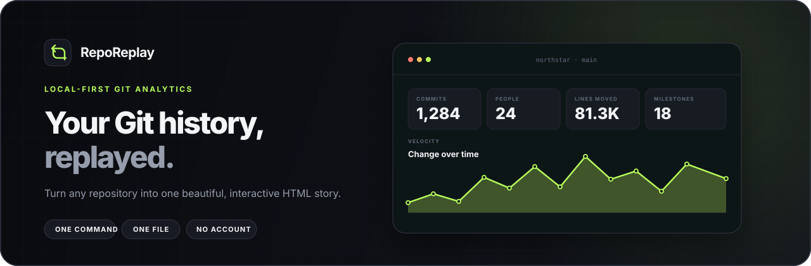
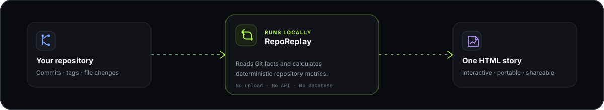

<p align="center">
  
</p>

<p align="center">
  <strong>Turn any Git repository into a beautiful, interactive story.</strong><br>
  One command. One standalone HTML file. Everything stays on your machine.
</p>

<p align="center">
  <a href="https://github.com/vKAYFv/reporeplay/actions/workflows/ci.yml"></a>
  <a href="LICENSE"></a>
  <a href="go.mod"></a>
  
</p>

<p align="center">
  <a href="#quick-start">Quick start</a> ·
  <a href="#see-your-repository-in-motion">Demo</a> ·
  <a href="#what-youll-discover">Features</a> ·
  <a href="#how-it-works">How it works</a> ·
  <a href="#contributing">Contributing</a>
</p>

---

Your repository already has a story: bursts of momentum, quiet rebuilds, people who shaped it, files that carried the hardest changes, and tags that marked a new chapter.

**RepoReplay makes that story visible.** It reads the Git history already on your computer and produces a polished report you can explore, share with your team, attach to a handoff, or use to showcase an open-source project.

<table>
  <tr>
    <td width="33%" valign="top">
      <strong>See momentum</strong><br><br>
      Explore velocity, active periods, daily rhythm, and tagged milestones without digging through raw logs.
    </td>
    <td width="33%" valign="top">
      <strong>Find the gravity</strong><br><br>
      Surface the files and top-level areas carrying the most historical change.
    </td>
    <td width="33%" valign="top">
      <strong>Share one file</strong><br><br>
      Send or archive a standalone report—no hosted dashboard, login, or database required.
    </td>
  </tr>
</table>

## Quick start

```bash
go install github.com/vKAYFv/reporeplay/cmd/reporeplay@latest
cd your-repository
reporeplay serve
```

RepoReplay opens a local report at `http://127.0.0.1:4173`. Want a portable artifact instead?

```bash
reporeplay build
# ✓ Report written to ./reporeplay.html
```

That file is the whole product experience: data, styles, charts, search, filters, and light/dark themes included.

> [!NOTE]
> Prebuilt macOS, Linux, and Windows binaries are attached to each [GitHub release](https://github.com/vKAYFv/reporeplay/releases). Git is the only system requirement.

## See your repository in motion

<p align="center">
  
</p>

The report is designed for exploration, not a static screenshot. Move through time, switch between 90 days, one year, and full history, search the commit stream, inspect hotspots, and change themes—all without a network connection.

## What you'll discover

| Question | RepoReplay view |
| --- | --- |
| **When did the project move fastest?** | Monthly velocity chart and selectable time range |
| **What does the contribution rhythm look like?** | A 52-week activity heatmap anchored to repository history |
| **Who shaped the codebase?** | Contributor share, activity window, and line movement |
| **Where does change concentrate?** | File hotspots and top-level surface-area map |
| **What is the repository made of?** | Current tracked-file mix by extension |
| **When did meaningful chapters ship?** | Lightweight and annotated Git milestones |
| **What exactly happened?** | Searchable commit stream with dates, files, and deltas |

RepoReplay describes activity—not productivity, developer performance, or code quality. The numbers stay close to the underlying Git facts and remain explainable.

## How it works

<p align="center">
  
</p>

- **Private by default.** Source files and commit data never leave your computer.
- **Forge-independent.** Works with GitHub, GitLab, Bitbucket, self-hosted remotes, and repositories with no remote at all.
- **Portable by design.** The generated report has no CDN assets, webfonts, tracking scripts, or backend calls.
- **Small attack surface.** The binary uses only the Go standard library and invokes Git only for read-only history commands.
- **Safe to share deliberately.** Author email addresses and remote credentials are removed from exported HTML and JSON.

## Commands

```text
reporeplay build [flags] [path]   Build reporeplay.html
reporeplay serve [flags] [path]   Preview on localhost
reporeplay version                Print version
```

```bash
# Choose the destination
reporeplay build --output ~/Desktop/project-story.html ../project

# Use the normalized data in another tool
reporeplay build --json --pretty . > repository-story.json

# Let the OS choose a free preview port
reporeplay serve --port 0 .
```

Flags must appear before the optional repository path. Run `reporeplay help` for the complete reference.

<details>
<summary><strong>Metric definitions and interpretation</strong></summary>

| View | Definition |
| --- | --- |
| Velocity | Commit volume aggregated by calendar month |
| Contribution rhythm | Daily commit activity over the final 52 weeks in repository history |
| Contributors | Commit share and line movement grouped by author identity |
| File mix | Extensions among files currently tracked by Git |
| Hotspots | Files ranked by `2 × commits + √(additions + deletions)` |
| Surface area | Historical line movement grouped by top-level path |
| Milestones | Git tags mapped to their target commits |

The time control updates headline statistics, velocity, and the commit stream. Hotspots and contributor rankings intentionally describe full history so their meaning remains stable while browsing.

Important boundaries:

- Merge strategy changes what history contains; a squash merge appears as one commit.
- Shallow clones only contain downloaded history. Run `git fetch --unshallow` for the complete story.
- Uncommitted and staged changes are excluded because RepoReplay describes recorded history.
- Binary files count as changes but have no line delta because Git reports it as `-`.
- Authors are grouped internally by commit email; addresses never appear in output.

</details>

<details>
<summary><strong>Architecture</strong></summary>

```text
internal/gitrepo   read and parse Git facts
        ↓
internal/analyzer  calculate deterministic metrics
        ↓
internal/report    embed safe JSON into the static interface
        ↓
reporeplay.html    open anywhere
```

The report renderer HTML-escapes the embedded JSON boundary and dynamic UI content. Remote URLs are normalized before export so credentials, query strings, and fragments cannot leak into an artifact.

</details>

## Development

```bash
make check     # formatting, vet, tests, and the race detector
make build     # bin/reporeplay
make demo      # generate a report for this repository
```

The test suite covers parser fixtures, a real temporary Git repository, binary changes, tags, detached branches, metric invariants, credential removal, and HTML script-boundary injection.

## Contributing

Focused contributions are welcome. Start with [CONTRIBUTING.md](CONTRIBUTING.md), use the issue templates for reproducible proposals, and report vulnerabilities privately through [SECURITY.md](SECURITY.md).

<p align="center">
  <strong>Your repository has already written the history.</strong><br>
  RepoReplay turns it into something worth exploring.
</p>

<p align="center">
  <a href="#quick-start"><strong>Build your first report →</strong></a>
</p>

## License

[MIT](LICENSE) © 2026 kayfdev
