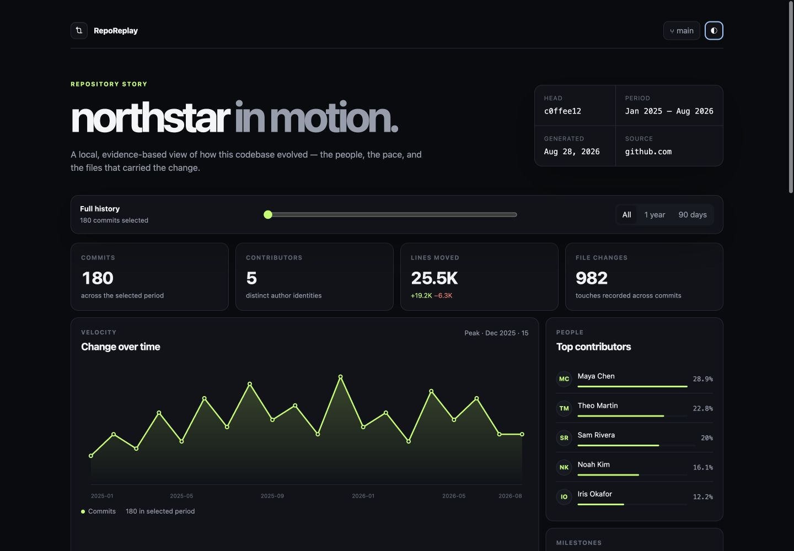

<div align="center">

# RepoReplay

**Turn any Git repository into an interactive, local-first story.**

One command. One standalone HTML file. No account, server, source upload, or runtime dependencies.

[](https://github.com/vKAYFv/reporeplay/actions/workflows/ci.yml)
[](LICENSE)
[](go.mod)

</div>



RepoReplay reads a repository's existing Git history and builds a polished report you can open, share, or archive. Explore velocity over time, contribution rhythm, authors, file mix, tagged milestones, top-level activity, and the files carrying the most change.

## Why RepoReplay?

Most repository analytics products require hosting, an account, or access to a forge API. RepoReplay uses the history already on your machine:

- **Local-first:** commit data never leaves your computer.
- **Portable:** the report is a single HTML file with embedded data, CSS, and JavaScript.
- **Forge-independent:** works with GitHub, GitLab, Bitbucket, self-hosted remotes, and repositories without a remote.
- **Useful immediately:** no config file, database, token, or frontend toolchain.
- **Honest metrics:** every number comes from `git log --numstat`; the report explains change, not code quality.

## Quick start

Build from source with Go 1.24 or newer:

```bash
go install github.com/vKAYFv/reporeplay/cmd/reporeplay@latest
cd your-repository
reporeplay build
```

Open `reporeplay.html` in any modern browser. To preview without writing a file:

```bash
reporeplay serve
# RepoReplay is serving your-repository at http://127.0.0.1:4173
```

Prebuilt binaries for macOS, Linux, and Windows are attached to every [GitHub release](https://github.com/vKAYFv/reporeplay/releases).

## Commands

```text
reporeplay build [flags] [path]   Build reporeplay.html
reporeplay serve [flags] [path]   Preview on localhost
reporeplay version                Print version
```

Examples:

```bash
# Analyze the current repository
reporeplay build

# Analyze another repository and choose the destination
reporeplay build --output ~/Desktop/project-story.html ../project

# Feed the normalized data to another tool
reporeplay build --json --pretty . > repository-story.json

# Let the OS choose an available local port
reporeplay serve --port 0 .
```

Flags must appear before the optional repository path. Run `reporeplay help` for the complete reference.

## What the report shows

| View | Meaning |
| --- | --- |
| Velocity | Commit volume aggregated by calendar month |
| Contribution rhythm | Daily commit activity over the final 52 weeks in repository history |
| Contributors | Commit share and line movement by author identity |
| File mix | File extensions among files currently tracked by Git |
| Hotspots | Files ranked by `2 × commits + √(additions + deletions)` |
| Surface area | Historical line movement grouped by top-level path |
| Milestones | Lightweight and annotated Git tags mapped to their commits |
| Commit stream | Searchable commits with authors, dates, file counts, and line deltas |

The time control updates headline statistics, the velocity chart, and commit stream. Hotspots and contributor rankings intentionally describe the full repository history so their meaning does not change while you browse.

### Important caveats

- RepoReplay reports repository activity, not productivity or developer performance.
- Merge strategy changes what Git history contains. Squash merges appear as one commit.
- Shallow clones only contain their downloaded history. Run `git fetch --unshallow` when you need the complete story.
- Uncommitted and staged changes are intentionally excluded; RepoReplay describes recorded Git history.
- Binary files count as file changes but do not contribute additions or deletions because Git reports them as `-`.
- Author identities are grouped by commit email internally, but email addresses are never included in HTML or JSON output.

## Architecture

```text
Git repository
     │
     │  git log / ls-files / for-each-ref
     ▼
┌──────────────┐    ┌────────────────┐    ┌──────────────────────┐
│ fact loader  │───▶│ metric analyzer│───▶│ embedded HTML report │
└──────────────┘    └────────────────┘    └──────────────────────┘
                                                   │
                                                   ▼
                                          reporeplay.html
```

The three stages deliberately have separate ownership:

- `internal/gitrepo` executes Git and parses stable, machine-readable separators.
- `internal/analyzer` turns raw commits into deterministic repository metrics.
- `internal/report` safely embeds JSON into a static interface compiled into the binary.

The project uses only the Go standard library. Git is the only external command and is never used to modify the analyzed repository.

## Development

```bash
make check     # format check, vet, tests with the race detector
make build     # bin/reporeplay
make demo      # reporeplay.html for this repository
```

Tests include parser fixtures, a real temporary Git repository, metric invariants, tag discovery, remote normalization, and an HTML script-boundary regression case.

## Contributing

Small, focused contributions are welcome. Read [CONTRIBUTING.md](CONTRIBUTING.md) before opening a pull request. For security issues, follow [SECURITY.md](SECURITY.md) instead of creating a public issue.

## License

RepoReplay is available under the [MIT License](LICENSE).
